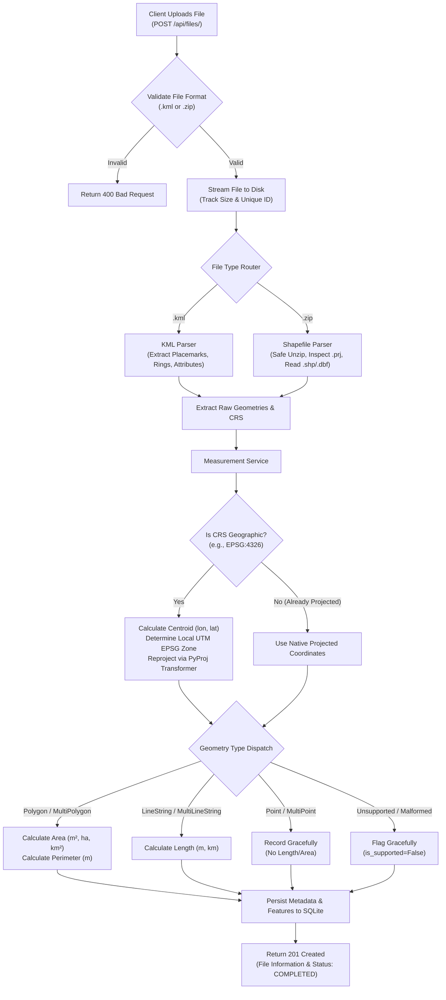

# Geospatial File Measurement API 🌍📐

[](https://fastapi.tiangolo.com)
[](https://python.org)
[](#license)
[](#testing)

A production-grade REST API backend service built with **FastAPI** that accepts geospatial files (**KML** and **ESRI Shapefiles in ZIP format**), extracts their geometric features, safely reprojects geographic coordinates to optimal metric planar coordinate systems, and computes geometric measurements (**Area** for Polygons, **Length** for LineStrings, and graceful handling for Points and unsupported geometry types).

---

## Table of Contents
1. [Overview](#overview)
2. [Key Features](#key-features)
3. [Architecture & Workflow](#architecture--workflow)
   - [Project Structure](#project-structure)
   - [File Processing Flow](#file-processing-flow)
   - [CRS Handling & Reprojection Strategy](#crs-handling--reprojection-strategy)
   - [Measurement Calculation Engine](#measurement-calculation-engine)
4. [API Reference & Examples](#api-reference--examples)
5. [Local Setup & Installation](#local-setup--installation)
6. [Docker Deployment](#docker-deployment)
7. [Running Tests](#running-tests)
8. [Design Decisions & Alternatives](#design-decisions--alternatives)
9. [Learnings & Future Roadmap](#learnings--future-roadmap)

---

## Overview

In aerial surveying, drone mapping, and GIS workflows, files frequently use geographic coordinates (e.g., `EPSG:4326` - WGS 84 latitude and longitude in degrees). Directly computing Euclidean area or distance on geographic coordinates yields meaningless numbers (e.g., "square degrees"). 

This service:
1. Ingests `.kml` or `.zip` (ESRI Shapefiles).
2. Extracts all vector geometries and metadata.
3. Automatically computes the localized **Universal Transverse Mercator (UTM)** projection zone for each feature's centroid.
4. Reprojects the geometry to metric planar coordinates (in meters).
5. Returns accurate metric measurements ($m^2$, hectares, $km^2$, meters, and kilometers) through a clean, documented RESTful API.

---

## Key Features

- **Multi-Format Ingestion:** Full support for OGC KML 2.2 (`.kml`) and zipped ESRI Shapefiles (`.zip` containing `.shp`, `.shx`, `.dbf`, and `.prj`).
- **Smart CRS Auto-Reprojection:** Resolves source CRS (e.g., from `.prj` or standard KML WGS84). If geographic (`EPSG:4326`), it dynamically determines the feature's local UTM zone (`EPSG:32601`–`32660` for North, `EPSG:32701`–`32760` for South) to guarantee planar metric precision.
- **Robust Geometry Engine:**
  - **Polygons:** Computes metric area ($m^2$, $ha$, $km^2$) and perimeter ($m$).
  - **LineStrings:** Computes metric length ($m$, $km$).
  - **Points:** Gracefully handled (no length/area, zero crashes).
  - **Unsupported/Null Geometries:** Flagged gracefully with diagnostic feedback.
- **Enterprise Ready:** Interactive Swagger UI (`/docs`), Redoc (`/redoc`), Dockerized container, SQLite persistence, and 100% passing test coverage.

---

## Architecture & Workflow

### Project Structure

```text
geospatial-measurement-api/
├── app/
│   ├── api/
│   │   ├── __init__.py
│   │   └── v1/
│   │       ├── __init__.py
│   │       └── endpoints.py          # FastAPI REST endpoints & HTTP validation
│   ├── core/
│   │   ├── __init__.py
│   │   ├── config.py                 # Application settings & environment config
│   │   └── exceptions.py             # Custom domain exceptions & HTTP mappings
│   ├── models/
│   │   ├── __init__.py
│   │   └── schemas.py                # Pydantic request/response validation schemas
│   ├── services/
│   │   ├── __init__.py
│   │   ├── crs_service.py            # CRS detection, UTM zone selection & reprojection
│   │   ├── measurement_service.py    # Metric area/length calculation & geometry dispatch
│   │   ├── file_service.py           # Orchestrates upload, parsing, processing & storage
│   │   └── parsers/
│   │       ├── __init__.py
│   │       ├── base.py               # Abstract base parser interface & ParsedFeature
│   │       ├── kml_parser.py         # XML-safe KML parser with namespace tolerance
│   │       └── shapefile_parser.py   # Safe ZIP extraction & pyshp Shapefile reader
│   ├── storage/
│   │   ├── __init__.py
│   │   └── repository.py             # SQLite thread-safe repository pattern
│   ├── __init__.py
│   └── main.py                       # FastAPI application factory & middleware
├── sample_data/
│   ├── sample.kml                    # Valid sample KML (Polygon, LineString, Point)
│   ├── parcels.zip                   # Valid sample Shapefile (Polygons with attributes)
│   ├── flight_paths.zip              # Valid sample Shapefile (LineStrings with attributes)
│   └── create_samples.py             # Script to regenerate sample datasets
├── tests/
│   ├── __init__.py
│   ├── conftest.py                   # Pytest fixtures and isolated test client setup
│   ├── test_api.py                   # End-to-end HTTP integration tests
│   ├── test_crs.py                   # Unit tests for CRS parsing and UTM calculation
│   ├── test_measurements.py          # Unit tests for geometric calculations
│   └── test_parsers.py               # Unit tests for KML and Shapefile parsers
├── Dockerfile                        # Multi-stage production container definition
├── docker-compose.yml                # Docker compose orchestration
├── requirements.txt                  # Locked Python dependencies
├── .dockerignore
├── .gitignore
└── README.md                         # Comprehensive documentation
```

### File Processing Flow



### CRS Handling & Reprojection Strategy

#### The Problem
Geographic coordinates (such as WGS 84 / `EPSG:4326`) represent positions as angles (degrees of latitude and longitude) on an ellipsoidal Earth. Calculating Euclidean distances or polygon areas directly on degree coordinates ($\Delta x \times \Delta y$) produces meaningless numbers because a degree of longitude shrinks as latitude moves toward the poles.

#### The Solution: Dynamic UTM Zone Selection
For every geographic feature, the system dynamically determines the optimal **Universal Transverse Mercator (UTM)** projection:
1. Compute the centroid $(\text{lon}, \text{lat})$ of the geometry.
2. Determine the UTM 6-degree longitudinal zone:
   $$\text{zone} = \left\lfloor \frac{\text{lon} + 180}{6} \right\rfloor + 1 \quad (1 \le \text{zone} \le 60)$$
3. Assign the hemisphere EPSG code:
   - Northern Hemisphere ($\text{lat} \ge 0$): $\text{EPSG} = 32600 + \text{zone}$
   - Southern Hemisphere ($\text{lat} < 0$): $\text{EPSG} = 32700 + \text{zone}$
4. Polar coordinates ($\lvert\text{lat}\rvert > 80^\circ$) are safely projected into Universal Polar Stereographic (UPS North: `EPSG:3413`, UPS South: `EPSG:3031`).
5. Reproject using vectorized `pyproj.Transformer` with `always_xy=True` into planar coordinates where units are **meters**.
6. Calculate Euclidean planar area and length using high-performance C-backed Shapely geometries.
7. As a cross-verification, WGS 84 ellipsoidal geodesic measurements are computed via `pyproj.Geod` and attached in diagnostic notes.

---

## API Reference & Examples

Interactive documentation is available at:
- **Swagger UI:** `http://localhost:8000/docs`
- **ReDoc:** `http://localhost:8000/redoc`

### Summary of Endpoints

| Method | Endpoint | Description |
|---|---|---|
| `POST` | `/api/files/` | Upload and process a `.kml` or Shapefile `.zip` file. |
| `GET` | `/api/files/{id}/` | Get summary information and status of an uploaded file. |
| `GET` | `/api/files/{id}/measurements/` | Retrieve calculated measurements for all features. |
| `GET` | `/api/files/{id}/features/` | Export extracted features in standard RFC 7946 GeoJSON format. |
| `GET` | `/api/files/` | List all uploaded files with pagination. |
| `DELETE` | `/api/files/{id}/` | Delete uploaded file metadata and artifacts. |
| `GET` | `/health` | Service health check probe. |

---

### Example Requests & Responses

#### 1. Upload File (`POST /api/files/`)
Upload a KML file or Shapefile ZIP:

```bash
curl -X POST "http://localhost:8000/api/files/" \
  -H "Accept: application/json" \
  -F "file=@sample_data/sample.kml"
```

**Response (`201 Created`):**
```json
{
  "id": "a8f69c64",
  "filename": "sample.kml",
  "file_type": "kml",
  "feature_count": 3,
  "crs": "EPSG:4326",
  "status": "COMPLETED",
  "error_message": null,
  "file_size_bytes": 1945,
  "created_at": "2026-10-07T15:54:48.169758Z"
}
```

---

#### 2. Get File Information (`GET /api/files/{id}/`)
Retrieve file status and metadata:

```bash
curl -X GET "http://localhost:8000/api/files/a8f69c64/"
```

**Response (`200 OK`):**
```json
{
  "id": "a8f69c64",
  "filename": "sample.kml",
  "file_type": "kml",
  "feature_count": 3,
  "crs": "EPSG:4326",
  "status": "COMPLETED",
  "error_message": null,
  "file_size_bytes": 1945,
  "created_at": "2026-10-07T15:54:48.169758Z"
}
```

---

#### 3. Get Measurements (`GET /api/files/{id}/measurements/`)
Retrieve metric measurements with projected CRS details:

```bash
curl -X GET "http://localhost:8000/api/files/a8f69c64/measurements/"
```

**Response (`200 OK`):**
```json
{
  "id": "a8f69c64",
  "filename": "sample.kml",
  "feature_count": 3,
  "crs": "EPSG:4326",
  "status": "COMPLETED",
  "total_area_sq_meters": 300422.7998,
  "total_length_meters": 775.2158,
  "features": [
    {
      "feature_id": "feature_poly_01",
      "geometry_type": "Polygon",
      "original_crs": "EPSG:4326",
      "projected_crs": "EPSG:32643 (UTM Zone 43N)",
      "is_supported": true,
      "measurements": {
        "area_sq_meters": 300422.7998,
        "area_hectares": 30.04228,
        "area_sq_km": 0.3004228,
        "length_meters": null,
        "length_km": null,
        "perimeter_meters": 2192.5375,
        "notes": "Calculated using projected planar coordinates (EPSG:32643 (UTM Zone 43N)). Geodesic WGS84 area: 300075.4 m²."
      },
      "properties": {
        "name": "Agricultural Survey Plot 1",
        "crop_type": "Wheat",
        "inspection_date": "2026-10-07"
      }
    },
    {
      "feature_id": "feature_line_01",
      "geometry_type": "LineString",
      "original_crs": "EPSG:4326",
      "projected_crs": "EPSG:32643 (UTM Zone 43N)",
      "is_supported": true,
      "measurements": {
        "area_sq_meters": null,
        "area_hectares": null,
        "area_sq_km": null,
        "length_meters": 775.2158,
        "length_km": 0.775216,
        "perimeter_meters": null,
        "notes": "Calculated using projected planar coordinates (EPSG:32643 (UTM Zone 43N)). Geodesic WGS84 length: 774.77 m."
      },
      "properties": {
        "name": "Drone Flight Transect",
        "flight_speed_mps": "12.5"
      }
    },
    {
      "feature_id": "feature_point_01",
      "geometry_type": "Point",
      "original_crs": "EPSG:4326",
      "projected_crs": null,
      "is_supported": true,
      "measurements": {
        "area_sq_meters": null,
        "area_hectares": null,
        "area_sq_km": null,
        "length_meters": null,
        "length_km": null,
        "perimeter_meters": null,
        "notes": "Point geometry does not have length or area."
      },
      "properties": {
        "name": "Base Station GCP 01",
        "elevation_m": "920.4"
      }
    }
  ]
}
```

---

## Local Setup & Installation

### Prerequisites
- Python 3.10+ (tested on Python 3.12 & 3.13)
- `git`

### Step 1: Clone the Repository
```bash
git clone https://github.com/Nikhil166-tech/geospatial-measurement-api.git
cd geospatial-measurement-api
```

### Step 2: Create and Activate Virtual Environment
**On Linux / macOS:**
```bash
python3 -m venv venv
source venv/bin/activate
```

**On Windows (PowerShell):**
```powershell
python -m venv venv
.\venv\Scripts\Activate.ps1
```

### Step 3: Install Dependencies
```bash
pip install --upgrade pip
pip install -r requirements.txt
```

### Step 4: Run the Application
```bash
uvicorn app.main:app --host 0.0.0.0 --port 8000 --reload
```
Access the application at `http://localhost:8000` and interactive docs at `http://localhost:8000/docs`.

---

## Docker Deployment

To build and run with Docker:

```bash
# Build and run with docker-compose
docker compose up --build -d

# Check running status
docker compose ps

# View real-time logs
docker compose logs -f
```

To stop:
```bash
docker compose down
```

---

## Running Tests

The test suite contains **18 unit and integration tests** covering API endpoints, KML parsing, Shapefile ZIP extraction, error handling, and CRS UTM reprojection.

Run tests using `pytest`:
```bash
pytest -v
```

Expected output:
```text
tests/test_api.py::test_health_check PASSED
tests/test_api.py::test_upload_kml_file PASSED
tests/test_api.py::test_upload_shapefile_zip PASSED
tests/test_api.py::test_upload_invalid_file_extension PASSED
tests/test_api.py::test_get_nonexistent_file PASSED
tests/test_api.py::test_delete_file PASSED
tests/test_crs.py::test_parse_crs PASSED
tests/test_crs.py::test_determine_optimal_projected_crs_utm_zones PASSED
tests/test_crs.py::test_already_projected_crs_preserved PASSED
tests/test_crs.py::test_project_geometry_transformation PASSED
tests/test_measurements.py::test_polygon_area_calculation PASSED
tests/test_measurements.py::test_linestring_length_calculation PASSED
tests/test_measurements.py::test_point_graceful_handling PASSED
tests/test_measurements.py::test_null_or_empty_geometry_handling PASSED
tests/test_parsers.py::test_parse_valid_kml PASSED
tests/test_parsers.py::test_parse_valid_shapefile_polygons PASSED
tests/test_parsers.py::test_parse_valid_shapefile_lines PASSED
tests/test_parsers.py::test_shapefile_missing_shp_raises_exception PASSED
======================= 18 passed in 0.80s =======================
```

---

## Design Decisions & Alternatives

1. **Framework Choice: FastAPI over Django + DRF**
   - *Decision:* Selected FastAPI for its native async capabilities, automatic OpenAPI/Swagger generation, Pydantic type validation, and high performance.
   - *Alternative Considered:* Django + DRF provides a robust admin panel, but introduces heavier ORM and migration overhead for a focused measurement microservice.

2. **Reprojection Strategy: Localized UTM Projections**
   - *Decision:* Implemented auto-selection of Universal Transverse Mercator (UTM) zones based on feature centroid longitudes and latitudes.
   - *Alternative Considered:* Using Web Mercator (`EPSG:3857`) causes severe distortion at higher latitudes (e.g. area inflation by $\sec^2(\text{lat})$). Using equal-area projections (such as `EPSG:6933`) preserves area but distorts line lengths. Local UTM zones deliver sub-millimeter precision for localized drone surveys.
   - *Bonus:* Geodesic ellipsoidal measurements via `pyproj.Geod` are included in notes for comparison.

3. **Parser Architecture: Pure-Python & Portable Geospatial Wheels**
   - *Decision:* Used `pyshp` (`shapefile`) for Shapefile parsing and `defusedxml` for secure KML parsing, combined with `shapely` and `pyproj`.
   - *Alternative Considered:* Direct OS-level GDAL/Fiona C bindings. While powerful, GDAL binaries often suffer from complex installation issues and platform-dependent wheel compilation conflicts on host machines. The chosen architecture is fully cross-platform and reliable in any CI/CD or Docker container.

4. **Security & Resiliency:**
   - **Zip Slip Defense:** Checked extracted archive paths to prevent malicious path traversal exploits.
   - **XXE Prevention:** Used `defusedxml` to protect against XML Entity Expansion attacks when parsing KML files.
   - **Graceful Error Handling:** Unsupported geometries or missing companion files return informative error structures rather than unhandled 500 crashes.

---

## Learnings & Future Roadmap

### Key Learnings
- **ESRI Polygon Winding Order:** The ESRI Shapefile specification enforces clockwise exterior rings and counter-clockwise interior rings (holes), which differs from standard GeoJSON RFC 7946 (counter-clockwise exterior). Proper sanitization ensures compatibility across viewers.
- **UTM Boundary Nuances:** Geometries spanning UTM zone boundaries require either local custom Transverse Mercator projection or geodesic calculations to maintain measurement accuracy.
- **KML Namespace Variations:** KML files generated by different GIS tools (Google Earth, QGIS, ArcGIS) frequently switch between default and custom XML namespaces. A tag-name agnostic lookup guarantees uninterrupted parsing.

### Future Improvements
1. **Asynchronous Background Processing (Celery + Redis):**
   - For massive multi-gigabyte files (e.g., millions of vertices or large drone orthomosaics), offload parsing to background workers with WebSocket status callbacks.
2. **3D Surface & Cut/Fill Volume Calculations:**
   - Support Digital Surface Models (DSM) and GeoTIFF Digital Elevation Models (DEM) to calculate stockpile volume, cut/fill, and 3D elevation surface areas.
3. **Point Cloud Support (LAS/LAZ):**
   - Ingest drone LiDAR point clouds to measure canopy height, ground classification, and structural volume.
4. **PostGIS Integration:**
   - Integrate PostgreSQL + PostGIS with spatial GiST indexes for sub-millisecond bounding box and nearest-neighbor spatial queries.
5. **Additional Geospatial Formats:**
   - Extend parser interfaces to support GeoPackage (`.gpkg`), FlatGeobuf (`.fgb`), and Cloud-Optimized GeoTIFF (COG).

---

## License
MIT License. Free for open source and commercial use.
